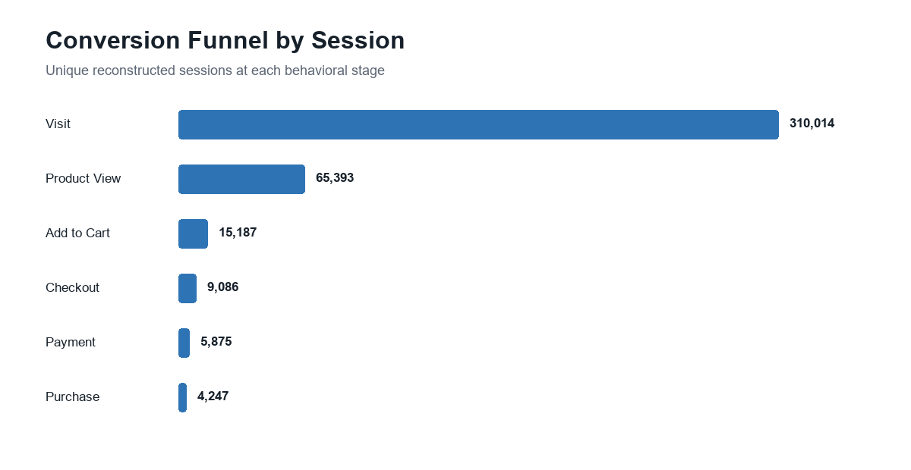

# E-commerce Conversion Analytics & Purchase Propensity ML

[](https://www.python.org/)
[](https://cloud.google.com/bigquery)
[](#machine-learning-results)
[](LICENSE)

An end-to-end analytics portfolio project that transforms 3.6 million GA4
e-commerce events into a conversion-funnel diagnosis, leakage-safe
machine-learning workflow, model evaluation, dashboard, and experiment
recommendation.

## Business problem

The store attracts substantial traffic, but only 1.37% of reconstructed
sessions end in a purchase. The business needs to determine where customers
leave the funnel, which acquisition and session-start signals identify
higher-intent traffic, and how limited product and marketing resources can be
focused without relying on information that becomes available only after a
session has progressed.

This project addresses two connected decisions:

1. **Product prioritization:** identify the funnel stages with the greatest
   opportunity for conversion improvement.
2. **Customer targeting:** rank incoming sessions by purchase propensity so
   that eligible users can be assigned to controlled interventions.

The model is intended as a decision-support and experimentation tool, not as
proof that any particular treatment causes a purchase.

## Research questions

1. At which funnel stage does the largest customer drop-off occur?
2. Should the company first improve product discovery, product pages, or
   checkout?
3. Can information available at the start of a session rank future purchase
   propensity for controlled experimentation?

## Run the project

**Start here:** [Ecommerce_Conversion_Analytics_Integrated.ipynb](Ecommerce_Conversion_Analytics_Integrated.ipynb)

The integrated notebook is the canonical implementation of the analysis
reported in the research paper. It reproduces the source-scale checks, complete
six-stage funnel, chronological split, hashed logistic regression, categorical
Naive Bayes comparison, calibration analysis, top-decile lift, executive
dashboard, and automated reconciliation checks.

It reads the external
[`data/session_level_ecommerce.csv.gz`](data/session_level_ecommerce.csv.gz)
file. The file contains standard CSV content with gzip compression, and pandas
reads it directly without a manual extraction step.
Open the repository in Jupyter or Google Colab and choose **Run All**. Every
table, metric, model result, and chart is generated inside the notebook and
retained as a visible output.

The main SQL workflow is limited to:

1. reconstructing one row per GA4 session, including all six funnel stages; and
2. creating the seven-variable leakage-safe session-start feature table.

The Python notebooks train the models reported in the paper. The
[`experiments/`](experiments/) directory contains a separate first-five-minute
behavioral BigQuery ML extension. Its features, prediction timing, and model
classes differ from the primary paper and should not be interpreted as a
direct reproduction of the reported results.

> **Portfolio highlight:** The highest-scored 10% of future sessions contains
> 20.1% of purchases, producing **2.01x lift** without using browsing,
> checkout, revenue, or other post-session information.


## Business results

| KPI | Result |
|---|---:|
| Events analyzed | 3,624,334 |
| Reconstructed sessions | 310,014 |
| Converted sessions | 4,247 |
| Conversion rate | 1.37% |
| Recorded revenue | $315,948 |
| Revenue per session | $1.02 |



- Visit to Product View loses 244,621 sessions, the largest absolute funnel leak.
- Product View to Add to Cart loses another 50,206 sessions.
- Payment to Purchase retains 72.29%, supporting discovery and product-detail
  experimentation before a checkout-first redesign.

## Machine-learning results

The evaluation uses a chronological split to approximate deployment:

- **Training:** November 16, 2020 through January 10, 2021; 228,487 sessions.
- **Test:** January 11 through January 31, 2021; 81,527 future sessions.
- **Positive class:** 912 purchases in the holdout, or 1.12%.

| Model | PR-AUC | ROC-AUC | Log loss | Brier | Top-10% recall | Lift |
|---|---:|---:|---:|---:|---:|---:|
| **Hashed logistic regression** | **0.0171** | 0.5868 | **0.0609** | **0.01105** | 20.1% | 2.01x |
| Categorical Naive Bayes | 0.0168 | **0.5947** | 0.0631 | 0.01138 | **20.3%** | **2.03x** |

Hashed logistic regression is selected using PR-AUC, the primary rare-event
metric, and provides better probability quality. Its seven categorical
session-start variables are encoded through deterministic feature hashing into
2,048 buckets. Performance is intentionally described as modest:
session-start context offers useful ranking signal but is not sufficient for
autonomous customer treatment.

## Leakage-safe design

The deployable feature contract includes only traffic source, traffic medium,
device category, operating system, country, day of week, and weekend status.
It excludes page views, product interactions, cart, checkout, payment,
purchase, transactions, revenue, engagement, event counts, and session
duration.

## Notebook-first repository

```text
.
|-- Ecommerce_Conversion_Analytics_Integrated.ipynb # Canonical paper analysis
|-- data/session_level_ecommerce.csv.gz             # Session-level analysis data
|-- sql/01_build_session_table.sql                   # GA4 event-to-session reconstruction
|-- sql/02_build_session_start_features.sql          # Seven leakage-safe model features
|-- src/train_model.ipynb                            # Paper model training workflow
|-- experiments/                                     # Optional five-minute BQML extension
|-- tests/validate_project.ipynb                     # Reproducibility checks
|-- artifacts/                                       # Reviewed model outputs
|-- assets/                                          # Notebook-generated figures
|-- dashboard/                                       # Dashboard definition
`-- docs/                                            # Model card and data dictionary
```

## Limitations

- The source covers a short observation window that includes seasonal shopping
  behavior, so results may not generalize to other periods.
- GA4 event instrumentation and session reconstruction can introduce missing,
  duplicated, or misordered funnel events.
- Session-start features intentionally exclude behavioral signals. This
  prevents leakage but limits discrimination and explains the modest PR-AUC.
- Country, device, and acquisition fields may proxy for operational or
  socioeconomic differences; targeting policies require fairness and
  experience-quality review.
- The chronological holdout estimates predictive performance, not the causal
  effect of a promotion, recommendation, or interface change.
- Revenue, margin, inventory availability, treatment cost, and customer
  lifetime value are not fully represented in the optimization objective.

## Conclusion and business recommendations

The evidence points to discovery and product-detail experience as the first
business priority. Visit to Product View accounts for the largest absolute
loss, while Payment to Purchase retains 72.29%; therefore, a broad checkout
redesign is less strongly supported than improvements that help visitors find
and evaluate relevant products.

Recommended actions:

1. **Prioritize the Visit-to-Product-View stage.** Test clearer navigation,
   search relevance, category merchandising, and landing-page-to-product
   continuity before investing in a checkout-first redesign.
2. **Use propensity scores for experiment allocation, not automatic
   persuasion.** Stratify eligible sessions by score and randomize treatment
   within score bands. The top 10% captures 20.1% of purchases at 2.01x lift,
   making this segment useful for capacity-constrained tests.
3. **Optimize for incremental business value.** Use conversion rate and
   revenue per eligible session as primary outcomes, then add margin or
   treatment cost when those data become available.
4. **Protect the customer experience.** Monitor latency, bounce rate,
   add-to-cart rate, refund or cancellation rate, and treatment exposure by
   device, geography, and acquisition channel.
5. **Scale only after causal validation.** Roll out an intervention only when
   the randomized test demonstrates material incremental value with acceptable
   guardrails; predictive lift alone is not a rollout decision.
6. **Refresh and monitor the model.** Track calibration, PR-AUC, top-decile
   lift, feature drift, and segment-level performance as traffic composition
   changes.

The practical value of the model is prioritization: it concentrates scarce
testing capacity where purchases are more common, while the funnel analysis
identifies which customer journey should be improved.

## Skills demonstrated

### Core workflow

`Python` | `pandas` | `NumPy` | `Matplotlib` | `Jupyter` | `BigQuery SQL` |
`GA4` | `feature engineering` | `classification` | `rare-event metrics` |
`chronological validation` | `data leakage prevention` | `calibration` |
`dashboard design` | `experiment design`

### Optional extension

`BigQuery ML` | `boosted trees` | `five-minute behavioral features`

## License

MIT License. The underlying GA4 public sample remains subject to its source
terms.


