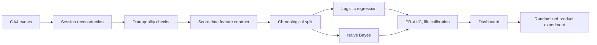

# E-commerce Conversion Analytics & Purchase Propensity ML

[](https://www.python.org/)
[](https://cloud.google.com/bigquery)
[](#machine-learning-results)
[](LICENSE)

An end-to-end analytics portfolio project that transforms 3.6 million GA4
e-commerce events into a conversion-funnel diagnosis, leakage-safe machine
learning system, model-monitoring dashboard, and experiment recommendation.

**Start here:** [Ecommerce_Conversion_Analytics_Integrated.ipynb](Ecommerce_Conversion_Analytics_Integrated.ipynb)

> **Portfolio highlight:** The highest-scored 10% of future sessions contains
> 20.1% of purchases, producing **2.01× lift** without using browsing,
> checkout, revenue, or other post-session information.


## Business question

1. Where does the e-commerce funnel lose the most sessions?
2. Can information available at session start rank sessions by purchase
   propensity?
3. How should the score be used without confusing prediction with causation?

## Key business findings

| KPI | Result |
|---|---:|
| Events analyzed | 3,624,334 |
| Reconstructed sessions | 310,014 |
| Converted sessions | 4,247 |
| Conversion rate | 1.37% |
| Recorded revenue | $315,948 |
| Revenue per session | $1.02 |


- The largest loss is **Visit → Product View**, where 244,621 sessions leave.
- The second-largest loss is **Product View → Add to Cart**, where 50,206
  sessions leave.
- Payment → Purchase converts at 72.29%, so discovery and product-detail
  experiments should be prioritized ahead of a checkout-first redesign.

## Machine-learning results

The dataset is split chronologically to approximate real deployment:

- **Training:** Nov 16, 2020–Jan 10, 2021 — 228,487 sessions.
- **Test:** Jan 11–31, 2021 — 81,527 future sessions.
- **Positive class:** 912 purchases in the holdout (1.12%).

| Model | PR-AUC | ROC-AUC | Log loss | Brier | Top-10% recall | Lift |
|---|---:|---:|---:|---:|---:|---:|
| **Hashed logistic regression** | **0.0171** | 0.5868 | **0.0609** | **0.01105** | 20.1% | 2.01× |
| Categorical Naive Bayes | 0.0168 | **0.5947** | 0.0631 | 0.01138 | **20.3%** | **2.03×** |

Logistic regression is selected using PR-AUC, the primary rare-event metric,
and has better probability quality. Performance is intentionally described as
modest: session-start context provides useful ranking signal, but it is not
strong enough for autonomous customer treatment.

## Leakage-safe design

The deployable model uses only:

- Traffic source and medium
- Device category and operating system
- Country
- Day of week and weekend status

It explicitly excludes page views, product views, cart, checkout, payment,
purchase, transactions, revenue, engagement, total events, and full-session
duration. These variables happen after scoring time or directly reveal the
outcome.



## Repository structure

```text
.
├── artifacts/      # Reviewed metrics, lift, and calibration outputs
├── assets/         # Portfolio-ready SVG figures
├── dashboard/      # Validated dashboard manifest and snapshot
├── data/           # Data access and schema instructions; raw data excluded
├── docs/           # Model card, data dictionary, and resume bullets
├── Ecommerce_Conversion_Analytics_Integrated.ipynb
├── sql/            # BigQuery sessionization, BQML, scoring, monitoring
├── src/            # NumPy/pandas training pipeline
└── tests/          # Artifact and leakage-contract checks
```

## Reproduce locally

```bash
python -m venv .venv
# Windows: .venv\Scripts\activate
# macOS/Linux: source .venv/bin/activate
pip install -r requirements.txt

python src/train_model.py \
  --input data/session_level_ecommerce.csv \
  --output artifacts
```

The raw 52 MB session export is intentionally excluded from GitHub. See
[data/README.md](data/README.md) for the expected schema and BigQuery
reconstruction path.

## Dashboard and model governance

The dashboard combines funnel KPIs with PR-AUC, ROC-AUC, top-decile recall,
lift, model comparison, calibration, and deployment controls. The model card
documents intended use, prohibited uses, drift risks, and the experiment-only
deployment gate.

## Recommended product action

Use propensity scores to stratify eligible sessions inside a randomized
experiment. Measure incremental conversion or revenue per eligible session and
monitor experience-quality guardrails. Propensity lift identifies where
conversion is concentrated; it does **not** prove that an intervention causes
conversion.

## Skills demonstrated

`Python` · `NumPy` · `pandas` · `BigQuery SQL` · `BigQuery ML` · `GA4` ·
`feature engineering` · `classification` · `rare-event metrics` ·
`chronological validation` · `data leakage prevention` · `calibration` ·
`dashboard design` · `product experimentation`

## License

MIT License. The underlying GA4 public sample remains subject to its source
terms.
