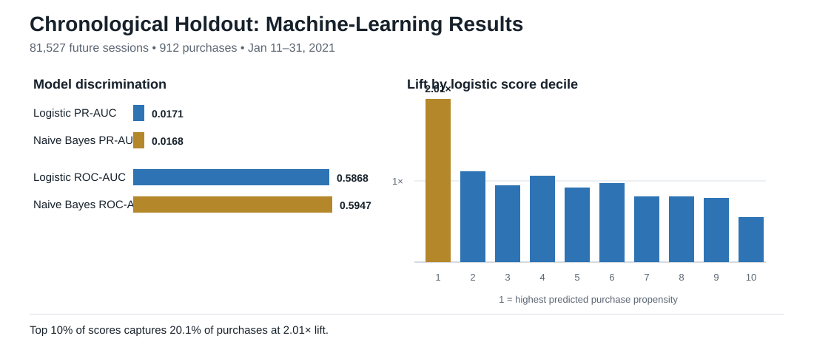
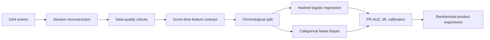

# E-commerce Conversion Analytics & Purchase Propensity ML

[](https://www.python.org/)
[](https://cloud.google.com/bigquery)
[](#machine-learning-results)
[](LICENSE)

An end-to-end analytics portfolio project that transforms 3.6 million GA4 e-commerce events into a conversion-funnel diagnosis, leakage-safe machine-learning system, model evaluation, and experiment recommendation.

## Run the complete project

**Start here:** [Ecommerce_Conversion_Analytics_Integrated.ipynb](Ecommerce_Conversion_Analytics_Integrated.ipynb)

The integrated notebook is fully self-contained. Its reviewed session-level modeling dataset is gzip-compressed and embedded directly in the notebook. Open the file in Jupyter or Google Colab and choose **Run All**. No repository CSV, JSON artifact, pre-generated image, SQL script, or local Python module is required.

> **Portfolio highlight:** The highest-scored 10% of future sessions contains 20.1% of purchases, producing **2.01x lift** without using browsing, checkout, revenue, or other post-session information.



## Business results

| KPI | Result |
|---|---:|
| Events analyzed | 3,624,334 |
| Reconstructed sessions | 310,014 |
| Converted sessions | 4,247 |
| Conversion rate | 1.37% |
| Recorded revenue | $315,948 |
| Revenue per session | $1.02 |


- Visit to Product View loses 244,621 sessions, the largest absolute funnel leak.
- Product View to Add to Cart loses another 50,206 sessions.
- Payment to Purchase retains 72.29%, supporting discovery and product-detail experimentation before a checkout-first redesign.

## Machine-learning results

The evaluation uses a chronological split to approximate deployment on future sessions:

- **Training:** November 16, 2020 through January 10, 2021; 228,487 sessions.
- **Test:** January 11 through January 31, 2021; 81,527 sessions.
- **Positive class:** 912 purchases in the holdout, or 1.12%.

| Model | PR-AUC | ROC-AUC | Log loss | Brier | Top-10% recall | Lift |
|---|---:|---:|---:|---:|---:|---:|
| **Hashed logistic regression** | **0.0171** | 0.5868 | **0.0609** | **0.01105** | 20.1% | 2.01x |
| Categorical Naive Bayes | 0.0168 | **0.5947** | 0.0631 | 0.01138 | **20.3%** | **2.03x** |

Logistic regression is selected using PR-AUC, the primary rare-event metric, and provides better probability quality. Performance is intentionally described as modest: session-start context offers useful ranking signal but is not sufficient for autonomous customer treatment.

## Leakage-safe design

The deployable feature contract includes only traffic source, traffic medium, device category, operating system, country, day of week, and weekend status. It excludes page views, product interactions, cart, checkout, payment, purchase, transactions, revenue, engagement, event counts, and session duration.



## Repository structure

```text
.
|-- Ecommerce_Conversion_Analytics_Integrated.ipynb  # Complete one-click project
|-- artifacts/      # Reviewed metrics, lift, and calibration outputs
|-- assets/         # Portfolio-ready SVG figures
|-- dashboard/      # Dashboard manifest and source snapshot
|-- data/           # Source schema and reconstruction instructions
|-- docs/           # Model card, data dictionary, and resume bullets
|-- sql/            # BigQuery sessionization, BQML, scoring, monitoring
|-- src/            # Standalone NumPy and pandas training pipeline
`-- tests/          # Artifact and notebook contract checks
```

## Recommended product action

Use propensity scores to stratify eligible sessions inside a randomized experiment. Measure incremental conversion or revenue per eligible session and monitor latency, bounce rate, refunds, and experience-quality guardrails. Predictive lift identifies where conversion is concentrated; it does **not** prove that an intervention causes conversion.

## Skills demonstrated

`Python` · `NumPy` · `pandas` · `Matplotlib` · `BigQuery SQL` · `BigQuery ML` · `GA4` · `feature engineering` · `classification` · `rare-event metrics` · `chronological validation` · `data leakage prevention` · `calibration` · `dashboard design` · `product experimentation`

## License

MIT License. The underlying GA4 public sample remains subject to its source terms.
